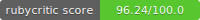

# Setup



## Integrantes de equipo
* Paola Lisset Santollo Vargas
* Alejandro Cabrera Moncada
* Ana Laura Arreola

## Pasos para ejecutar el proyecto
1. Descargar el repositorio
2. Instalar gemas con el comando:
  ``` 
  bundle install 
  ```

3. Ejecutar proyecto 
```
ruby lib/args_parser.rb -l -p 8080 -d /usr/logs
``` 
* Nota, si es una lista  se ejecuta 
```
ruby lib/args_parser.rb -g this,is,a,list -d 1,2,3,4,-5
```
## Pasos para ejecutar el archivo de pruebas
1. Ejecutar pruebas con el comando
```
rspec specs
```

## Verificar puntuacion de rubycritic en el proyecto
1. Ejecutar comando
```
rubycritic lib
```

# Verificar la puntuacion de rubycritic en las pruebas
1. Ejecutar comando 
```
rubycritic specs
```

# Verificar puntuación Sandi-meter
1. Ejecutar comando
```
sandi_meter 
 ```